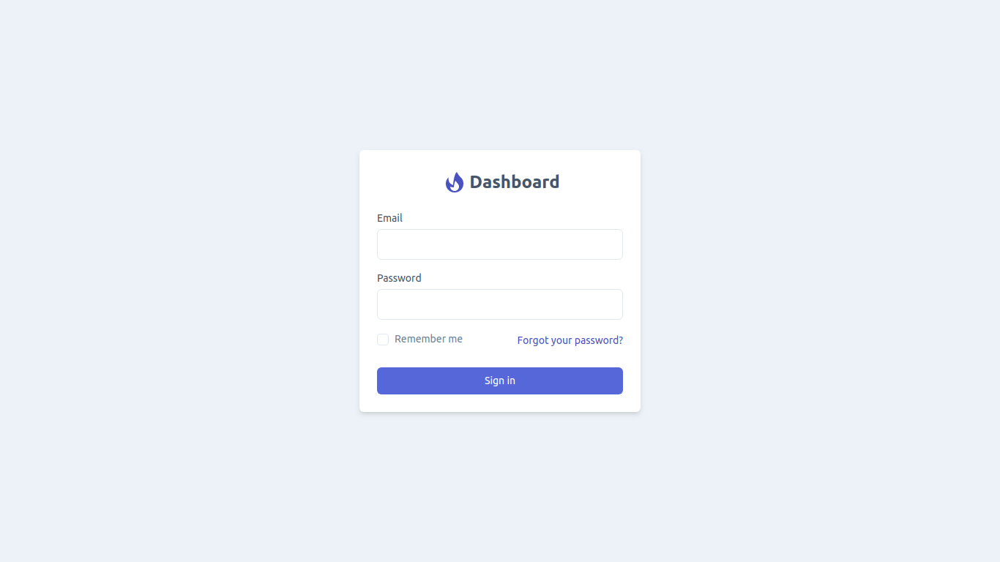
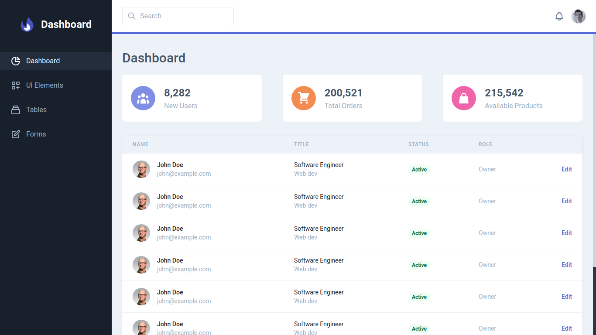
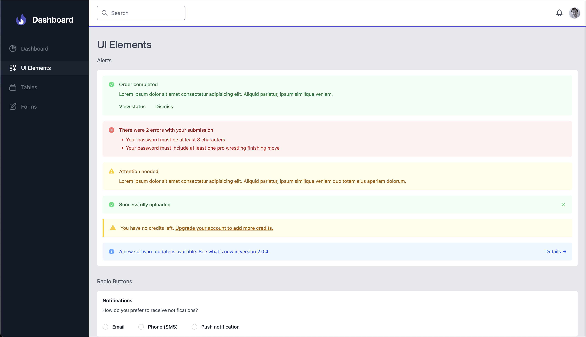
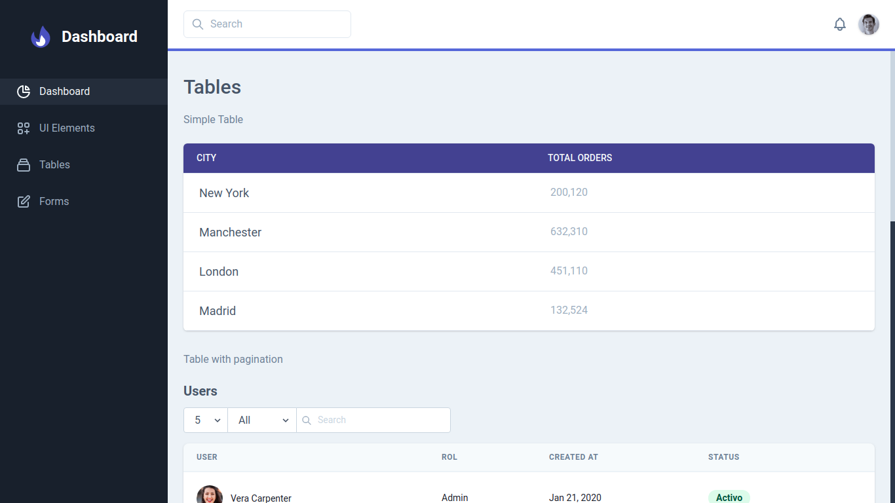
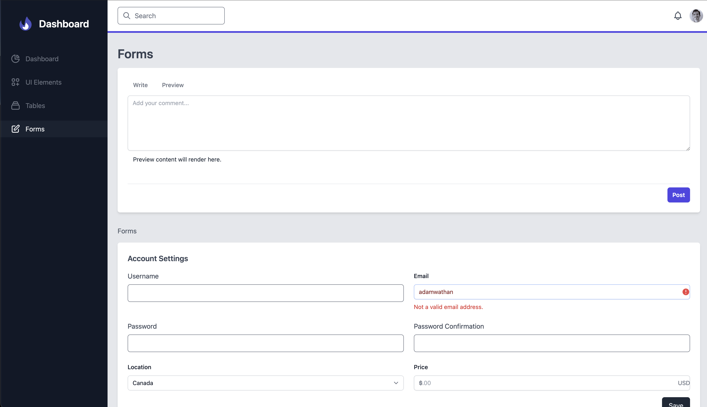

# Dashboard Template


Start template for dashboard projects build with Tailwindcss, Alpinejs and Laravel blade.


## Resources
- [Tailwindcss](https://tailwindcss.com)
- [AlpineJS](https://github.com/alpinejs/alpine)
- [Heroicons](https://heroicons.dev)

## Screenshots

Login



Dashboard



UI Elements



Tables



Forms



## Project setup
```
npm install
```

### Compiles and hot-reloads for development
```
npm run watch
```

### Compiles and minifies for production
```
npm run production
```